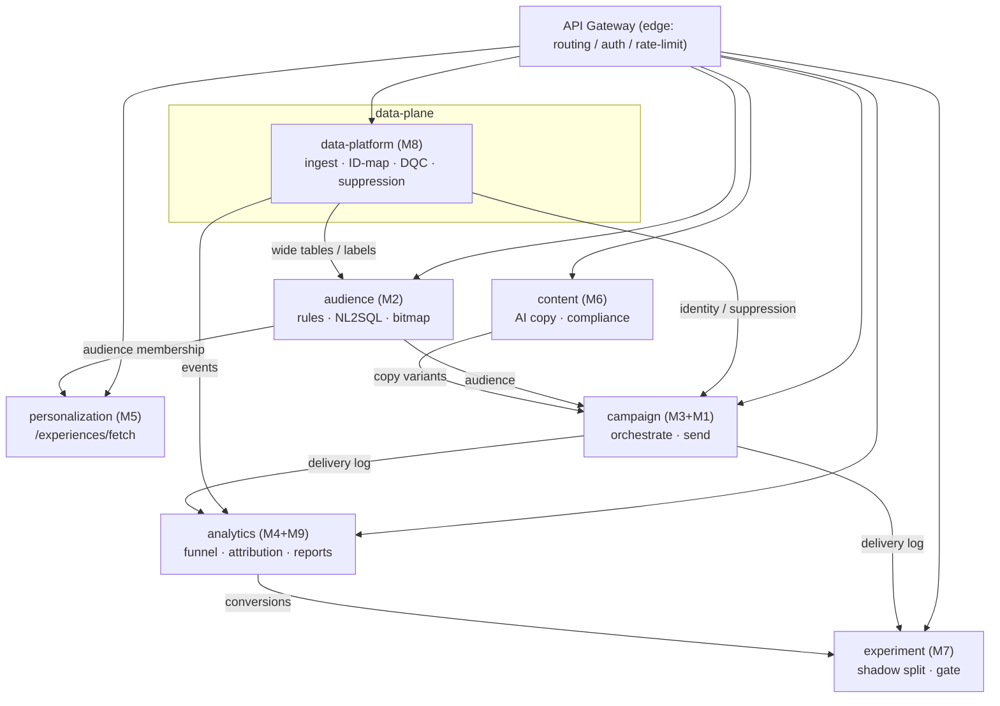

# Botim Growth Platform — Architecture Overview

A self-built replacement for MoEngage, covering the survey's full scope (M1–M9).
This document describes how the 9 modules are grouped into **7 independently
deployable services** behind a thin **API gateway** — decomposed by functional
cohesion, scaling profile, and team ownership, **not** as one monolith.

Scale context: UAE launch, ~**2.5M** users (≈¼ of the population). Mostly batch
campaigns with some triggered/real-time; data cleaning is T+1 (data team) with
hourly freshness on the engagement side. No email; primary key = customer_id / phone.
All time semantics unified to **Asia/Dubai (UTC+4)**.

---

## 1. Modules → Services map

| Service (deployable) | Modules | Plane | Why grouped / split |
|---|---|---|---|
| **data-platform** | M8 | data-plane (batch) + thin lookup API | Ingestion/warehouse/DQC are batch jobs; only identity-resolve & suppression need a low-latency API. Distinct data ownership. |
| **audience** | M2 | request + heavy batch | Rule engine / NL2SQL / bitmap. Compute-heavy cohort runs over 2.5M users; separate scaling. |
| **personalization** | M5 | request (edge, hot path) | `/experiences/fetch` is **latency-critical, high-QPS, app-facing** (home-screen card). Must scale & cache independently of everything else. |
| **campaign** | M3 + M1 | request (author/trigger) + async workers | Orchestration calls the messaging gateway; both are send-pipeline concerns (rate-limited to Botim's push API, queue/worker heavy). Tightly coupled → one service. |
| **content** | M6 | request (LLM-bound) | AI copy generation is cost/latency-bound on an LLM provider; isolate so its scaling & spend don't affect the hot path. |
| **analytics** | M4 + M9 | read-heavy (OLAP) | Funnel/attribution + the few reports operators view + auto-insights. M9 reuses M4; cohesive read workload. |
| **experiment** | M7 | governance (low volume) | Shadow split / dedup / non-inferiority gate. Cross-cutting cutover governance; low traffic but must be isolated & auditable. |

> Dashboards / full BI are intentionally **out of scope** (data team + Amplitude).

---

## 2. Service dependency graph

**Key contracts (shared lib `growth_common`)** keep services decoupled:
`DeliveryRecord` (the user-level touch-log schema everyone reads/writes),
`MessagingGateway` protocol (campaign ↔ messaging), and deterministic
`stable_fraction` bucketing (so A/B/control assignment is identical across
campaign, personalization, and experiment without coordination).

---

## 3. Request-plane vs data-plane vs async

- **Request-plane (sync, user/ops facing):** audience evaluate/nl2sql, personalization fetch, content generate, analytics queries, experiment report. Latency budgets differ wildly → separate services & autoscaling (personalization fetch is the strictest).
- **Data-plane (batch/stream):** data-platform ingestion → wide tables/labels (T+1 + hourly), audience large-cohort bitmap runs, analytics aggregation. Throughput-bound, scheduled.
- **Async workers:** campaign send execution — fan-out over an audience, rate-limited to Botim's push/SMS APIs, with frequency-cap/dedup. Queue-backed; never blocks the authoring request.

---

## 4. API Gateway (thin edge)

The gateway does **only cross-cutting concerns** — never business logic:

| Concern | Behavior |
|---|---|
| Routing | prefix table → service (see §5). In prod a reverse proxy (Envoy/Kong/API GW); in this repo `api_gateway.py` mounts the service apps in-process for a runnable demo. |
| Auth | require non-empty `MOE-APPKEY` on `/api/*` → else **401**. `/health` is open. (Token/appkey model mirrors MoEngage's SDK auth.) |
| Rate limiting | per-APPKEY token bucket → over limit **429** (configurable; protects Botim's downstream send APIs). |
| Discovery/health | `GET /health` → status + mounted-service map. |
| (prod) | TLS termination, request-id/tracing, WAF, canary routing. |

Each service is **independently runnable** (`uvicorn services.audience:app`) and
independently deployable/scalable; the gateway is stateless and horizontally scalable.

---

## 5. Gateway routing table

| Prefix | Service | Representative endpoints |
|---|---|---|
| `/api/data` | data-platform | `POST /identity/resolve`, `POST /suppression/check`, `POST /ingest`, `GET /dqc` |
| `/api/audience` | audience | `POST /segments/evaluate` · `/segments/size` · `/segments/compile` · `/nl2sql` · `GET /templates` |
| `/api/personalize` | personalization | `POST /experiences/fetch` · `POST /experiences` · `POST /experiences/{key}/publish` |
| `/api/campaign` | campaign | `POST /campaigns/run` · `POST /messages/send` |
| `/api/content` | content | `POST /copy/generate` · `/copy/compliance` · `/copy/select-best` |
| `/api/analytics` | analytics | `POST /funnel` · `/attribution` · `/reports/{name}` · `/insights` |
| `/api/experiment` | experiment | `POST /shadow/split` · `/shadow/report` |

---

## 6. End-to-end flow (home-screen activation campaign)

1. **data-platform** ingests footprint events → wide tables + labels; exposes identity & suppression.
2. **audience** resolves a cohort ("KYC, balance≥1000, wallet inactive") — via rules or NL2SQL.
3. **content** generates compliant multilingual copy variants (en/ar/hi/tl) → A/B/N.
4. **campaign** runs: dedup/freq-cap (using data-platform suppression) → deterministic A/B + control hold-out → send via messaging (Botim push API), emitting the delivery log.
5. **personalization** independently serves the home-screen card payload at fetch time (hot path), reusing the same audience definition.
6. **experiment** runs a 5% shadow split with a dedup middle-layer, then a non-inferiority gate decides "not worse than MoEngage".
7. **analytics** computes the funnel (incl. cross-product Call→Wallet→Remittance), attribution, and the operator reports.

(`examples/e2e_demo.py` + `tests/test_integration_e2e.py` exercise this chain in-process.)

---

## 7. Scaling & deployment notes

- **personalization** — highest QPS, tight latency: horizontal pods + read-through cache of precomputed audience membership; degrade to "default" payload on miss.
- **audience** — bitmap (RoaringBitmap) audience algebra for 2.5M-scale set ops; batch cohort refresh hourly/T+1; OLAP engine TBD by the data team (compile-to-SQL path ready).
- **campaign** — worker pool + queue; global rate-limit token bucket protects Botim's push/SMS APIs; frequency-cap/dedup state in a fast store.
- **content** — isolated so LLM latency/cost is contained; deterministic offline provider as fallback.
- **data-platform** — scheduled pipelines; thin lookup API cached.
- **experiment / analytics** — read replicas / OLAP; low write volume.
- **Cross-service consistency** — deterministic `stable_fraction` means audience/campaign/personalization/experiment agree on each user's bucket with zero coordination.

---

## 8. Module ↔ feature-list traceability

| Service | Module | Feature doc |
|---|---|---|
| audience | M2 | `Growth-Feature-List-M2.md` (+ NL2SQL/bitmap) |
| campaign | M1, M3 | `Growth-Feature-List-M1.md`, `-M3.md` |
| analytics | M4, M9 | `Growth-Feature-List-M4.md`, `-M9.md` |
| personalization | M5 | `Growth-Feature-List-M5.md` |
| content | M6 | `Growth-Feature-List-M6.md` |
| experiment | M7 | `Growth-Feature-List-M7.md` |
| data-platform | M8 | `Growth-Feature-List-M8.md` |

Test coverage: **269 tests** across all modules + services + the e2e integration test
(`pytest`); CI runs them on Python 3.10/3.11/3.12.
