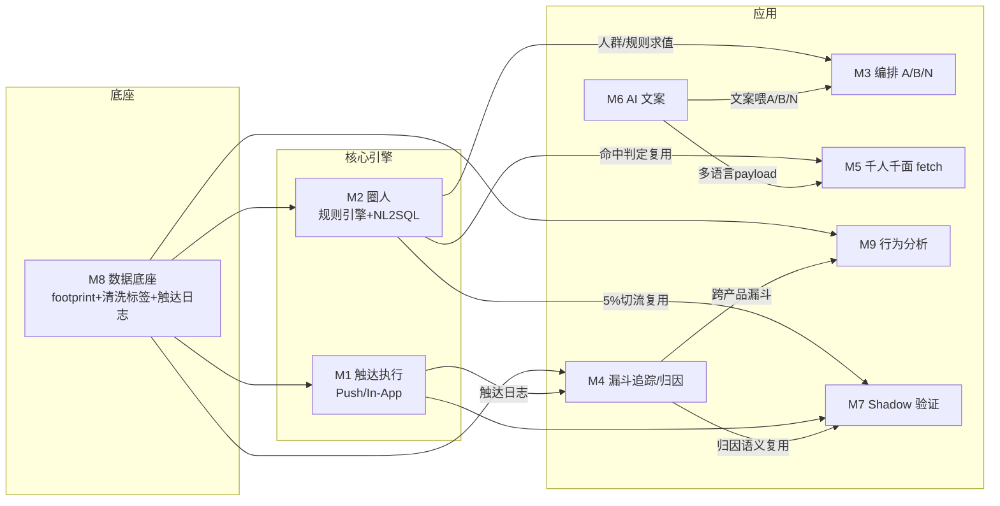

# Growth 特性清单 · 全模块总览索引（M0）

> Botim 自研增长平台（MoEngage 竞品替换）· 9 模块总纲
> 配套明细：`Growth特性清单-M1-1.md` … `M9-1.md`（每个含 特性清单/AI与增强汇总/工作量/依赖/风险/Phase/补全记录）
> 依据：MoEngage 录屏 ×2 + `用增问题survey-updated v3.xlsx`（Survey/Plan/数据分析专项）。时区统一 Asia/Dubai；无 email。

---

## 1. 一页总览（9 模块）

| 模块 | 名称 | 优先级 | 条数 | 人日 | 一句话定位 |
|---|---|---|---:|---:|---|
| **M1** | 触达执行（Push+In-App） | **P0 最高** | 18 | 33 | Push 走 Botim 自有通道、In-App SDK 自渲染；补全触达日志 |
| **M2** | Cohort 圈人（规则引擎+NL2SQL） | **P0** | ~33 | 64 | 复刻圈人引擎 + 兼容层 + **AI 破"很难用"** |
| **M3** | 内容与推送编排（A/B/N） | **P0** | 23 | 51 | 复刻 content/排期 + **AI 编排 + 频控去重(填补空白)** |
| **M4** | Campaign 漏斗追踪 | **P0** | 22 | 36 | 推送埋点→漏斗/归因 + **跨产品漏斗(MoEngage答不了)** |
| **M7** | Shadow 验证框架 | **P0 验收命门** | 16 | 23 | 5% 对照 + **去重中间层防双发** + 自动显著性报告 |
| **M8** | 数据底座（我方部分） | **P0 前置** | 19 | 26 | 接 footprint+消费清洗标签+触达日志宽表(主体清洗归数据组) |
| **M5** | 千人千面（自建下发） | **P1** | 26 | 43 | 对等 `/experiences/fetch`、命中复用 M2、**彻底去 MoEngage 依赖** |
| **M6** | AI 文案 | **P1** | 14 | 19 | **纯增量**：多语种生成 + 文案-效果闭环 |
| **M9** | 行为分析（降配） | **P2** | 13 | 24 | 只搬 5–10 张真看报表 + 自动化分析；**与数据组/Amplitude 划界** |
| — | ~~Dashboard / 全量 BI~~ | **不做** | — | — | 数据组马老板重建 / 产品侧 Amplitude |

**工作量汇总**：P0 核心 ~253 · P1(M5+M6) ~62 · P2(M9) ~24 · 横切 ~20 = **全量 ~359 人日**（含 15% 缓冲 ~410）。

---

## 2. 跨模块依赖图



**文字版关键链**
- **M8 是总前置**：无宽表/标签/ID-mapping/触达日志 → M2/M4/M9/M1 都动不了。
- **M2 是共享引擎**：被 M3(分流)、M5(命中)、M7(切流) 复用——一处建、多处用。
- **M4 是归因语义中枢**：被 M7(对照报告)、M9(复盘) 复用，口径必须统一。
- **M1+M8 触达日志** 前置于 M4、M7。
- **M6 文案** 喂 M3(A/B/N) 与 M5(payload)。

---

## 3. 🤖 AI 亮点地图（"增量靠 AI" 主线，row6）

| 模块 | AI 能力 | 价值 |
|---|---|---|
| **M2** | NL2SQL 自然语言圈人 / 准确率兜底 / Lookalike / 倾向分群 / 分群算法优化 | **破"很难用"**(row32)，降配置门槛 |
| **M3** | AI 编排（GPT 替代编排，row22） | 自然语言→人群+文案+排期+Flow，**提活动量** |
| **M6** | 多语种文案生成 + 文案-效果闭环学习 | 印/菲/阿/英一键生成，提效率 |
| **M9** | 数据分析自动化 + NL2SQL 问数 | 活动后自动复盘洞察 |
| **M1** | 送达可达性预测/无效用户过滤 | 过滤已卸载/离线，提有效送达 |
| **M5** | 个性化变体智能推荐（可选） | 千人千面增强 |

> AI 四大主载体：**M2 NL2SQL 圈人 · M3 AI 编排 · M6 AI 文案 · M9 自动化分析**——构成"不低于现状靠复刻、增量靠 AI"的叙事。

---

## 4. ★ 差异化地图（相对 MoEngage 的增强，对外可高举）

| 级别 | 差异化能力 | 模块 | survey 依据 |
|---|---|---|---|
| 🌟🌟🌟 | **跨产品漏斗**（MoEngage 答不了，服务渗透率 7.5%→15%） | M4 | row14/7 |
| 🌟🌟🌟 | **AI 编排 + NL2SQL**（增量靠 AI） | M3/M2 | row22/6/29 |
| 🌟🌟 | **破"很难用"**：可视化构造器+实时人数预估 | M2 | row32 |
| 🌟🌟 | **跨活动频控/去重/静默**（现状完全空白） | M3/M7 | row38/42 |
| 🌟🌟 | **"数字对得上"对账可信机制** | M4 | row14 |
| 🌟 | 送达可达性过滤 + 多渠道兜底 | M1 | row43 |
| 🌟 | Shadow 去重中间层防双发 | M7 | D24/row38 |
| 🌟 | 激活沉睡的 footprint 全量备份（免重新埋点） | M8 | row49 |
| 🌟 | 彻底去 MoEngage 依赖（千人千面自建） | M5 | row73 |

---

## 5. 全量甘特（两段式：6 周 MVP + 完整替换）

```
阶段                     周次→ 1  2  3  4  5  6 | 7  8  9 10 11 12 13 14 15 16 17
P0 准备/选型(数据·schema·口径)  ████
P1 底座M8 + 触达M1                  ██████████
P2 圈人M2 + 编排M3 + 漏斗M4                  ████████████████
P3 千人千面M5 + AI文案M6                              ██████████
P-Shadow M7(验收命门, W5-6起)              ██████              ██████
P4 行为分析M9 + 联调 + UAT                                      ██████████
```
- **Phase 1（W1–W6，Plan）**：MVP + Shadow，**复用现有规则引擎+薄层**，跑通 1–2 高频场景(如钱包激活 Push)、5% 流量对照，证明"不低于 MoEngage"。约 140–170 人日。
- **完整替换（Phase 2+）**：8–10 人，**≈13–17 周（约 3–4 个月）**。
- 实时占比小(批量为主)→ T+1 路线利好工期；若实时活动 >30%，M2 近实时与 M3 触发型加重。

---

## 6. 前置阻塞总表（估算的真正前置，目前多为"待问"）

| 责任方 | 需提供 | 卡住的模块 |
|---|---|---|
| **数据组(马老板)** | ID-Mapping 表+覆盖率(D2)、清洗 T+1、脱敏样本(D4)、历史取数需求+SQL 分布(D5–D9)、标签字典(D10–D12)、口径统一(D29)、内部指标消费方(D26)、BI 工具栈(D27) | M8 · M2 · NL2SQL · M4 · M9 |
| **Growth(迪拜,Radhika)** | Top Cohort 定义(D13)、真看报表清单(D25)、Flow 节点类型/复杂度(row35/36)、每用户频次政策、Shadow 场景+验收标准 | M2 · M3 · M4 · M7 · M9 |
| **裴青** | 事件 schema、数据样本协调、安排迪拜跟跑 | M8（→连带全部） |
| **MoEngage 厂商** | 触达流水接入方式/延迟(D23)、隐藏 Webhook/Connector | M7 |

> ⚠️ D1–D32 几乎全"待问"——本套清单人日在数据/答案到位前为 **±30% 区间**。**开工第一优先级 = 关闭这些前置访谈（Plan W1–W2）**。

---

## 7. 关键风险（跨模块）
- **R1 估算条件性**：前置数据未到位前为 ±30%。
- **R2 实时占比是工期开关**：实时>30% → 6 周 MVP 吃紧。
- **R3 NL2SQL 可行性**：取决于历史 SQL 复杂度/重复模板占比(D6/D7)；策略=高频模板覆盖+人工兜底，不赌全自动。
- **R4 口径分裂**：转化/活跃/留存无全公司定义(D29)；M4 归因须先对齐再开发。
- **R5 Shadow 双发**：去重中间层(M7)是硬需求，否则对照失真。
- **R6 内部指标依赖**：RFM/churn/engagement 若有人用(row57/D26)，停用前需在 M2/M8 补齐。

---

## 8. 文件索引
| 文件 | 模块 | Phase |
|---|---|---|
| `Growth特性清单-M1-1.md` | 触达执行 | P0 |
| `Growth特性清单-M2-1.md` | Cohort 圈人 | P0 |
| `Growth特性清单-M3-1.md` | 内容与推送编排 | P0 |
| `Growth特性清单-M4-1.md` | Campaign 漏斗追踪 | P0 |
| `Growth特性清单-M7-1.md` | Shadow 验证框架 | P0 |
| `Growth特性清单-M8-1.md` | 数据底座 | P0 前置 |
| `Growth特性清单-M5-1.md` | 千人千面（自建下发） | P1 |
| `Growth特性清单-M6-1.md` | AI 文案 | P1 |
| `Growth特性清单-M9-1.md` | 行为分析（降配） | P2 |
| `Botim增长平台_基于Survey的重新分析.md` | 综合分析（scope/工期/依赖） | — |

---

## 9. 一句话收口
**复刻 MoEngage 的圈人(M2)+编排(M3)+触达(M1)+漏斗(M4) 保"不低于现状"；用 AI(NL2SQL/编排/文案/自动化) + 跨产品漏斗 + 频控 + 易用性做"增量"；千人千面(M5) 自建去依赖；Shadow(M7) 守验收；数据底座(M8) 复用 footprint 打地基。Dashboard/全量 BI 不做。**
